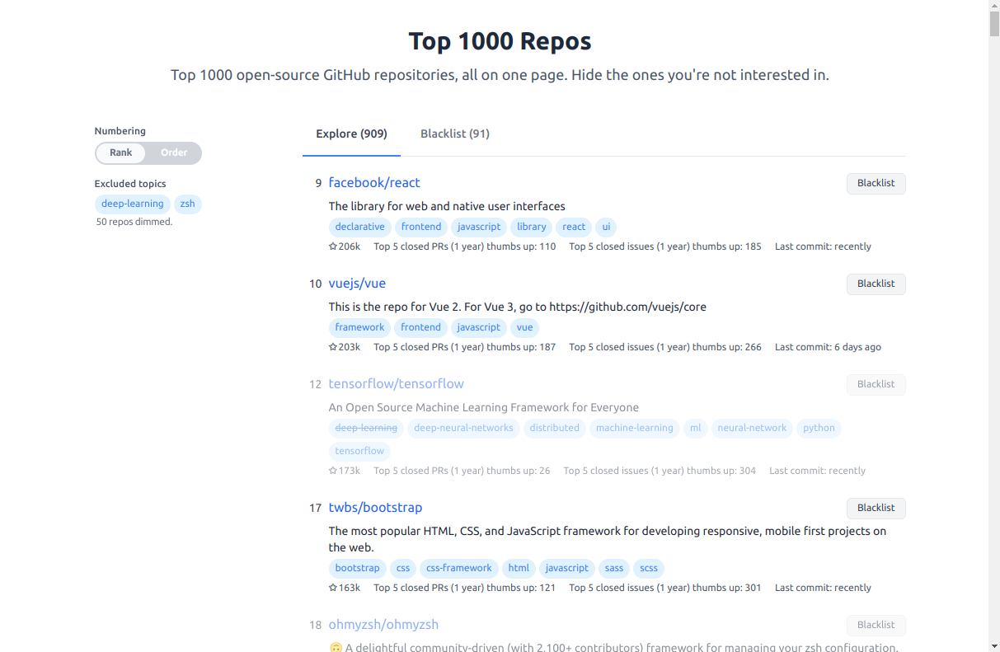

# Top 1000 Repos

Top 1000 GitHub repositories, all on one page. Hide the ones you're not interested in.

https://top1000repos.com

## Screenshot




## Developing

### Install dependencies
```
npm install
```

### Setup environment variables
```
PUBLIC_BACKEND_URL='http://localhost:3000' # https://kit.svelte.dev/docs/modules#$env-static-public
```

### Start development server:

```bash
npm run dev
```

## Building

To create a production version of the app:

```bash
npm run build
```

You can preview the production build with `npm run preview`.

> To deploy the app, you may need to install an [adapter](https://kit.svelte.dev/docs/adapters) for your target environment.